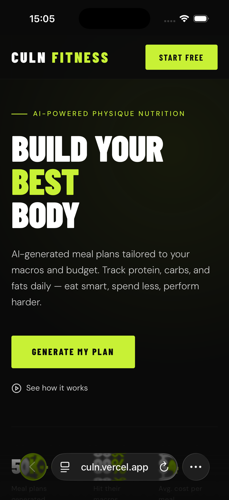
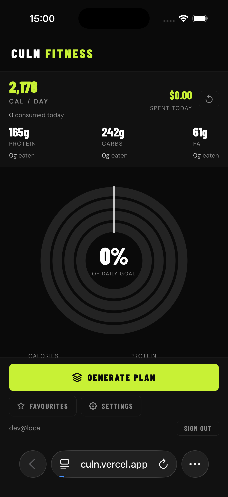
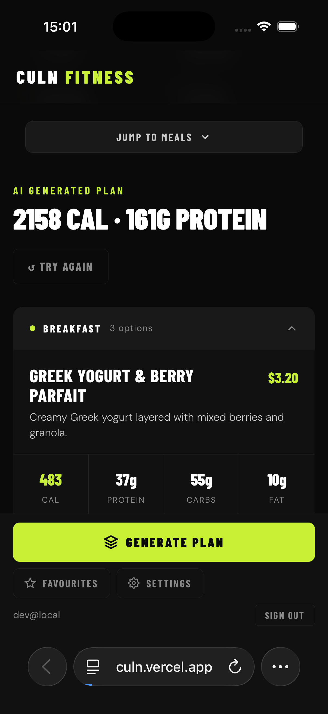
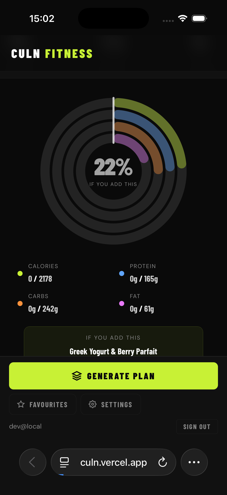

# Culn Fitness

A mobile-first PWA for personalized meal planning and nutrition tracking.

**Live demo: [culn.vercel.app](https://culn.vercel.app)**. Install it to your home screen on iOS or Android.

## Screenshots

  
  
  
  

<em>Landing · daily targets · a generated plan · what a meal would add before you log it.</em>

## Features

- **Onboarding** — collects body stats, goals, dietary restrictions, budget, and cooking time
- **Macro calculator** — uses Mifflin-St Jeor BMR → TDEE to compute daily calorie and macro targets
- **Meal generator** — produces a full day's meal plan grouped by meal type (breakfast, lunch, snack, dinner), each with 3 options to choose from
- **Nutrition rings** — visual progress rings for calories, protein, carbs, and fat
- **Meal tracker** — add individual meals to your daily log and watch the rings fill in real time
- **Budget tracking** — tracks daily spend against your weekly budget
- **Cooking instructions** — step-by-step instructions and ingredient lists on every meal card

## Stack

- Pure HTML / CSS / JavaScript — no framework, no build step
- Supabase for auth and user profile storage
- Anthropic Claude API for AI meal generation (demo mode included for local use without an API key)
- PWA — installable on iOS and Android via manifest + service worker

## Running locally

Just open `generator.html` in a browser. No server or build step required.

### Demo mode vs. live generation

The app ships with `DEMO_MODE = true` (in `generator.html`, just above `generatePlan()`), which serves a curated sample plan so the hosted demo works without an API key.

To generate real plans with Claude, set `DEMO_MODE = false`. On first use the app asks for an [Anthropic API key](https://console.anthropic.com), which is stored only in the browser's `localStorage` and sent only to the Anthropic API.
